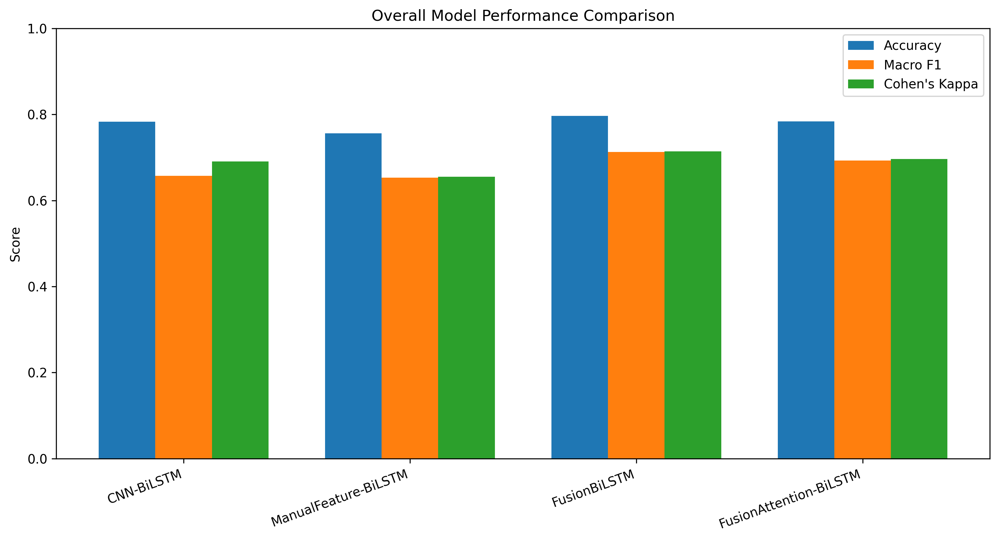
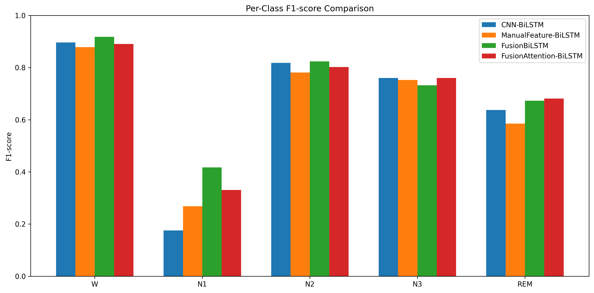
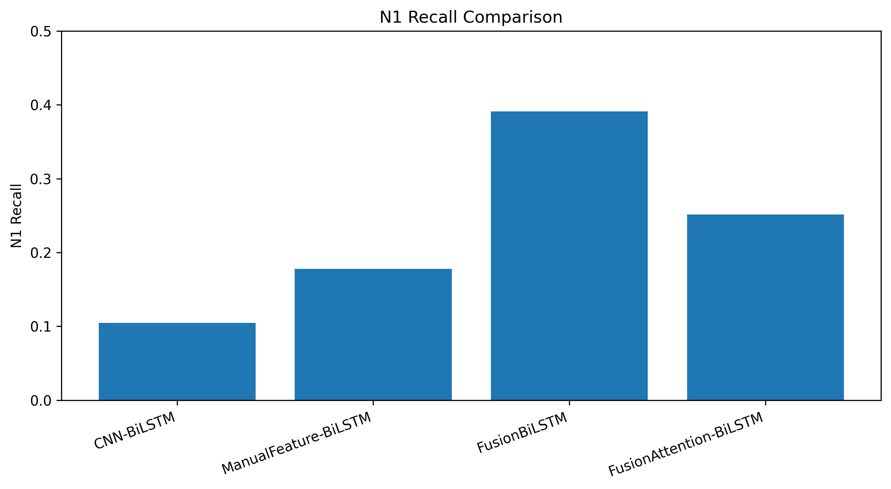
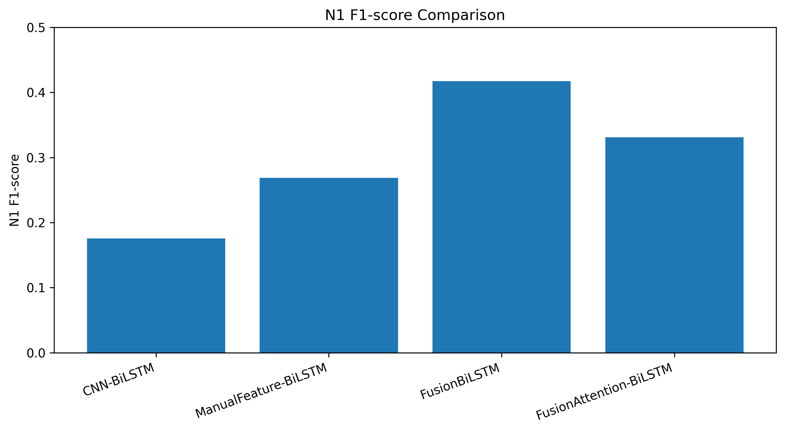
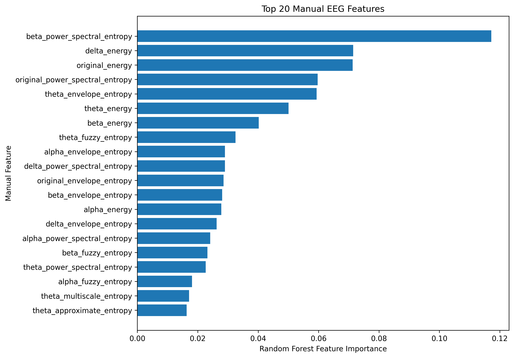
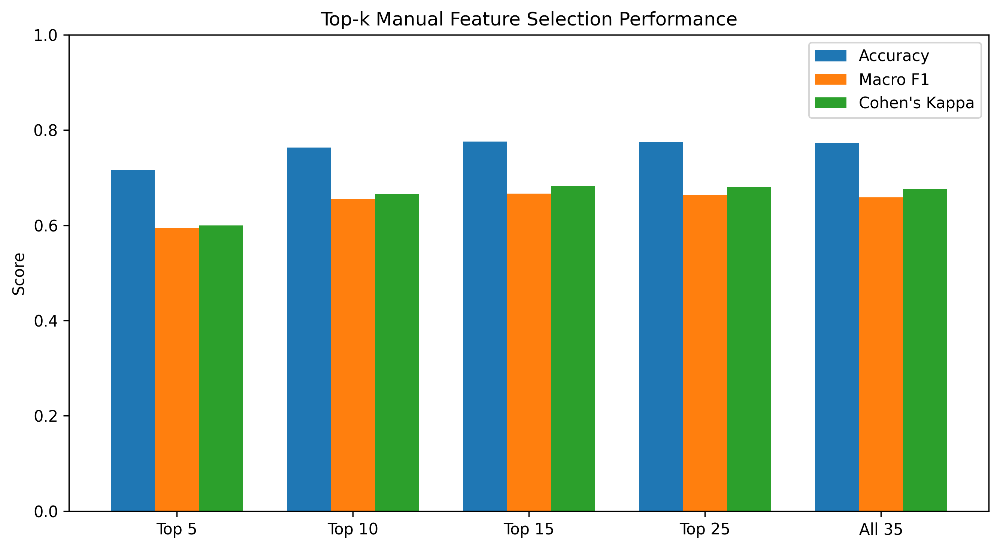

EEG-Based Automatic Sleep Stage Classification with Manual Features and Fusion Models
This project focuses on automatic sleep stage classification from single-channel EEG signals using the Sleep-EDF dataset. The work is inspired by the paper “Automated sleep staging from single-channel electroencephalogram using hybrid neural network with manual features and attention” by Wan et al. (iScience, 2025).
The aim of this project is not only to run an existing implementation, but to build a more reliable, explainable, and academically defensible sleep staging pipeline. The project includes subject-independent evaluation, handcrafted EEG feature extraction, raw EEG deep learning models, feature fusion, temporal attention, and detailed class-wise analysis.
---
Project Highlights
Subject-independent train/validation/test split to reduce data leakage risk
Memory-efficient lazy loading dataset pipeline
35-dimensional handcrafted EEG feature extraction
Manual feature cache generation and validation
CNN-BiLSTM raw EEG baseline
ManualFeature-BiLSTM baseline
Raw EEG + manual feature FusionBiLSTM model
FusionAttention-BiLSTM model with temporal attention
Detailed evaluation with Accuracy, Macro F1-score, Cohen’s Kappa, confusion matrix, classification report, and N1-specific error analysis
Thesis-ready result figures and tables
---
Dataset
This project uses the Sleep-EDF dataset.
Each EEG recording is divided into 30-second epochs. Since the sampling rate is 100 Hz, each epoch contains:
```text
100 Hz × 30 seconds = 3000 samples
```
The processed EEG data has the following format:
```text
x shape = [num_epochs, 3000]
y shape = [num_epochs]
```
Sleep stages are mapped as follows:
Sleep Stage	Label
W	0
N1	1
N2	2
N3	3
REM	4
Movement and unknown stages are removed. Sleep stages 3 and 4 are merged into N3.
---
Subject-Independent Split
To reduce data leakage risk, the dataset is split by subject instead of by individual EEG sequences.
Recordings from the same subject are assigned only to one of the following sets:
Training set
Validation set
Test set
Final split:
Split	Subjects	Files
Train	54	107
Validation	11	22
Test	13	24
Subject overlap check:
```text
Train ∩ Validation: 0
Train ∩ Test      : 0
Validation ∩ Test : 0
```
---
Manual Feature Extraction
A 35-dimensional handcrafted EEG feature vector is extracted for each 30-second EEG epoch.
The feature extraction pipeline includes:
Bandpass filtering between 0.3 Hz and 45 Hz
4-level wavelet decomposition
Extraction of rhythmic components:
Original EEG
Delta
Theta
Alpha
Beta
Seven features extracted from each signal component:
Energy
Approximate entropy
Fuzzy entropy
Multiscale entropy
Permutation entropy
Power spectral entropy
Envelope entropy
Therefore:
```text
5 signal components × 7 features = 35 features
```
The generated manual feature cache was validated:
```text
manual files: 153
total manual epochs: 199352
bad file count: 0
all valid: True
```
---
Implemented Models
1. CNN-BiLSTM
Raw EEG baseline model:
```text
Raw EEG → CNN Encoder → BiLSTM → Classifier
```
Input shape:
```text
[batch_size, seq_len, 3000]
```
2. ManualFeature-BiLSTM
Manual feature baseline model:
```text
35 Manual Features → BiLSTM → Classifier
```
Input shape:
```text
[batch_size, seq_len, 35]
```
3. FusionBiLSTM
Hybrid fusion model:
```text
Raw EEG → CNN Encoder
Manual Features → Dense Projection
CNN Feature + Manual Feature → BiLSTM → Classifier
```
This model achieved the best overall performance.
4. FusionAttention-BiLSTM
Fusion model with temporal attention:
```text
Raw EEG + Manual Features → Fusion → BiLSTM → Temporal Attention → Classifier
```
The attention mechanism produces temporal attention weights:
```text
attention shape = [batch_size, seq_len]
attention row sum mean = 1.000000
```
---
Experimental Results
All models were evaluated on the subject-independent test set.
Model	Raw EEG	Manual Features	Attention	Accuracy	Macro F1	Cohen’s Kappa
CNN-BiLSTM	Yes	No	No	78.34%	0.6574	0.6910
ManualFeature-BiLSTM	No	Yes	No	75.62%	0.6531	0.6555
FusionBiLSTM	Yes	Yes	No	79.70%	0.7128	0.7142
FusionAttention-BiLSTM	Yes	Yes	Yes	78.36%	0.6929	0.6964
The best overall model was FusionBiLSTM.
These results suggest that raw EEG representations and handcrafted EEG features provide complementary information for automatic sleep stage classification.
---
Result Figures
Overall Model Performance

Per-Class F1-score Comparison

N1 Recall Comparison

N1 F1-score Comparison

---
## Manual Feature Selection Analysis

To further improve interpretability, Random Forest feature importance was used to rank the 35 handcrafted EEG features. Different top-k feature subsets were evaluated using Top 5, Top 10, Top 15, Top 25, and all 35 features.

| Feature Set | Accuracy | Macro F1 | Cohen’s Kappa | N1 F1 |
|---|---:|---:|---:|---:|
| Top 5 | 71.61% | 0.5946 | 0.5996 | 0.1431 |
| Top 10 | 76.37% | 0.6552 | 0.6660 | 0.2090 |
| Top 15 | **77.61%** | **0.6670** | **0.6832** | **0.2252** |
| Top 25 | 77.45% | 0.6637 | 0.6803 | 0.2126 |
| All 35 | 77.28% | 0.6584 | 0.6772 | 0.1955 |

The best feature selection result was obtained with the Top 15 selected manual features. This suggests that not all handcrafted EEG features contribute equally to sleep stage classification. A smaller selected feature subset can provide better performance and improve interpretability.

### Top Manual EEG Features

The most important handcrafted features included spectral entropy, energy, and envelope entropy features from beta, delta, original EEG, theta, and alpha components.



### Top-k Feature Selection Performance


---
N1 Stage Analysis
The N1 stage was the most difficult class across all models. However, the FusionBiLSTM model improved N1 classification performance.
Model	N1 F1-score	N1 Recall
CNN-BiLSTM	0.1758	0.1049
ManualFeature-BiLSTM	0.2686	0.1780
FusionBiLSTM	0.4174	0.3910
FusionAttention-BiLSTM	0.3309	0.2516
The FusionBiLSTM model achieved the best N1 performance, showing that combining learned raw EEG representations with handcrafted EEG features helped the model better distinguish the transitional N1 stage.
---
Project Structure
```text
.
├── dataset.py
├── network.py
├── train.py
├── test.py
├── manual_features.py
├── train_manual.py
├── test_manual.py
├── train_fusion.py
├── test_fusion.py
├── train_fusion_attention.py
├── test_fusion_attention.py
├── check_manual_cache.py
├── make_results_figures.py
├── focal_loss.py
├── results/
│   └── results_summary.csv
├── figures/
│   ├── model_performance_comparison.png
│   ├── per_class_f1_comparison.png
│   ├── n1_recall_comparison.png
│   └── n1_f1_comparison.png
└── README.md
```
Large files such as raw data, generated feature cache files, and model checkpoints are not included in the repository.
---
How to Run
Generate manual features
```bash
python manual_features.py --npz_dir ./data/sleepedf/npz --output_dir ./data/sleepedf/manual_features_e100 --build_cache --entropy_max_len 100
```
Validate manual feature cache
```bash
python check_manual_cache.py
```
Train CNN-BiLSTM baseline
```bash
python train.py --seq_len 20 --batch_size 4 --n_epochs 3 --network LSTM --bidirectional
```
Train ManualFeature-BiLSTM
```bash
python train_manual.py --manual_dir ./data/sleepedf/manual_features_e100 --seq_len 20 --batch_size 16 --n_epochs 10 --bidirectional
```
Train FusionBiLSTM
```bash
python train_fusion.py --npz_dir ./data/sleepedf/npz --manual_dir ./data/sleepedf/manual_features_e100 --seq_len 20 --batch_size 4 --n_epochs 3 --bidirectional
```
Train FusionAttention-BiLSTM
```bash
python train_fusion_attention.py --npz_dir ./data/sleepedf/npz --manual_dir ./data/sleepedf/manual_features_e100 --seq_len 20 --batch_size 4 --n_epochs 3 --bidirectional
```
---
Key Findings
The FusionBiLSTM model achieved the best overall performance.
Combining raw EEG representations with handcrafted EEG features improved Macro F1-score compared with raw-only and manual-only baselines.
The largest improvement was observed in the N1 stage.
The attention model provided temporal interpretability but did not outperform the non-attention fusion model in overall performance.
Subject-independent evaluation was used to reduce data leakage risk.
---
Limitations
The manual feature extraction parameters were reimplemented based on the paper description. Since some entropy parameters were not fully specified in the paper, standard parameter choices were used.
Entropy-based features were computed on a compact representation of each epoch to make full-dataset feature extraction computationally feasible.
The models were trained on CPU, so the number of epochs was limited.
Further hyperparameter tuning may improve performance.
---
Technologies Used
Python
NumPy
SciPy
PyWavelets
PyTorch
scikit-learn
Matplotlib
Seaborn
Sleep-EDF dataset
---
Author
Developed as an academic graduation project by a Computer Engineering student.
This project demonstrates practical experience in:
Biomedical signal processing
EEG preprocessing
Deep learning with PyTorch
Feature engineering
Sequence modeling
Subject-independent evaluation
Model fusion
Attention-based analysis
Academic machine learning experimentation